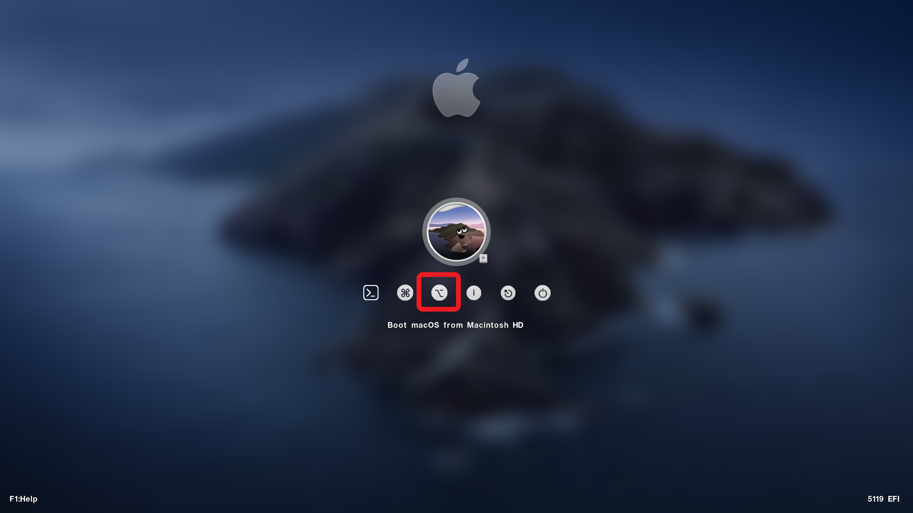
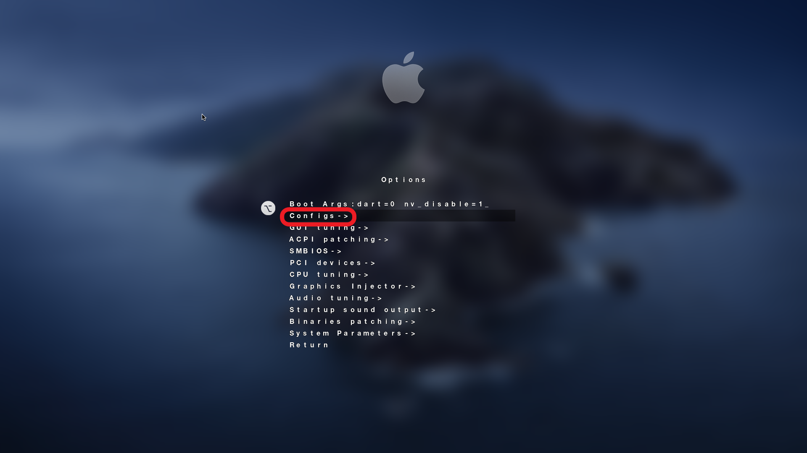
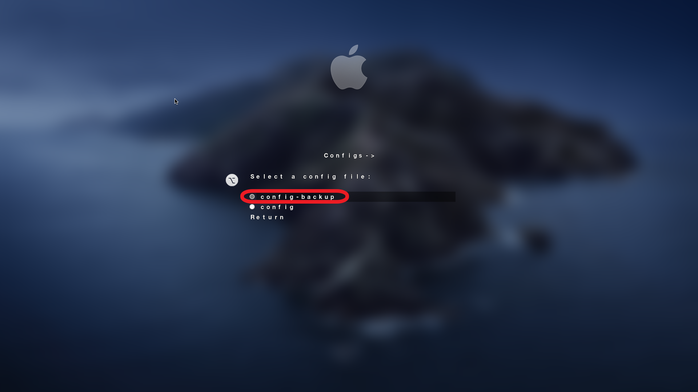

# 『Hackintsoh』ASUS-H110M-K + i5-7500

此說明文件是個人在摸索中製作的筆記，記錄途中的一些過程。

## 目錄

- [『Hackintsoh』ASUS-H110M-K + i5-7500](#hackintsohasus-h110m-k--i5-7500)
  - [目錄](#目錄)
  - [系統版本](#系統版本)
  - [螢幕截圖](#螢幕截圖)
  - [硬體配置](#硬體配置)
  - [使用工具](#使用工具)
  - [BIOS 配置](#bios-配置)
  - [驅動配置](#驅動配置)
    - [預設產生驅動配置](#預設產生驅動配置)
    - [使用 Hackintool 配置驅動](#使用-hackintool-配置驅動)
  - [已知問題](#已知問題)
  - [基本操作](#基本操作)
    - [開啟 EFI 磁碟](#開啟-efi-磁碟)
    - [使用 Clover Configurator 開啟 config.plist](#使用-clover-configurator-開啟-configplist)
  - [進階操作](#進階操作)
    - [開機自動進入系統](#開機自動進入系統)
    - [Clover 開機畫面磁碟隱藏](#clover-開機畫面磁碟隱藏)
    - [修改 Clover 開機預設佈景主題](#修改-clover-開機預設佈景主題)
    - [製作 config-backup.plist 備份開機設定](#製作-config-backupplist-備份開機設定)
    - [開啟系統 HiDPI](#開啟系統-hidpi)
    - [自訂適合自己螢幕的 HiDPI 分辨率](#自訂適合自己螢幕的-hidpi-分辨率)
    - [開啟 SSD 支援 TRIM 功能](#開啟-ssd-支援-trim-功能)
    - [開啟允許從「任何來源」下載的App](#開啟允許從任何來源下載的app)
  - [參考資料](#參考資料)

## 系統版本

- OS：`MacOS Catelina 10.15.6`

## 螢幕截圖


## 硬體配置

- 主機板：`ASUS H110M-K`
- CPU：`Intel Core i5-7500 Kaby Lake`
- CPU Graphics：`Intel HD Graphics 630`
- PCIe Graphics：`none`
- Audio：`Realtek ALC887`
- Ethernet：`Realtek RTL8111H`
- RAM：`Crucial Technology DDR4 2400MHz 8GB*2`
- Storage：`ADATA SU800 256GB SSD`

## 使用工具

- [UniBeast 10.3.0 - Catalina 10.3.0](https://www.tonymacx86.com/resources/unibeast-10-3-0-catalina.490/)

- [Clover Configurator 5.14.1.0 (Global Edition)](https://mackie100projects.altervista.org/download-clover-configurator/)

- [Hackintool v3.4.2](https://github.com/headkaze/Hackintool/releases)

## BIOS 配置

BIOS 配置每張主機板規格與配置都不同，網路上已有很多推薦設定，照著對應設定即可，沒有設定選項的就略過，也不一定要設定相同才能啟動，只是建議這樣設定而已。

1. 載入預設 BIOS 設定
2. Intel Virtualization Technology `關閉` > `開啟`
3. VT-d `關閉` > `開啟`
4. Above 4G Decoding `關閉` > `開啟`
5. DVMT Pre-Allocated[64M] > [128M]
6. 主動 LPM 支援 `關閉` > `開啟`
7. 序列埠 `開啟` > `關閉`
8. 從儲存裝置啟動 `Legacy only` > `UEFI 驅動程式優先`
9. 安全啟動 `啟動` > `關閉`
10. 啟動作業系統類型 `Windows UEFI 模式` > `其他作業系統`

## 驅動配置

### 預設產生驅動配置

基本驅動為使用 `UniBeast` 自動產生，預設安裝環境沒有使用顯卡功能，可在安裝完 MacOS 系統完畢後，再修改 `EFI` > `config.plist` 圖形卡部分，同時注入音效卡 ID。

> - Graphics
>   - [x] Inject Intel
>   - ig-platform-id：`59120000`
> - Device > Fake ID
>   - IntelGFX：`59128086`

> - Device > Audio
>   - Inject ID：`7`
>   - [x] ResetHDA

> - SMBIOS
>   - Product Name：`iMac 18.1`

以下皆為自動產生

- Clover 版本：`Clover UEFI r5119`
- 音效卡驅動：`AppleALC v1.5.0`
- 內核驅動：`Lilu v1.4.5`
- 網路卡驅動：`RealtekRTL8111 2.2.2`
- 仿真器驅動：`VirtualSMC 1.1.4`
- 圖形卡驅動：`WhateverGreen 1.4.0`
- USB 驅動：
    | Name*                               | Find* [HEX] | Replace* [HEX] | Comment                                                           |
    | ----------------------------------- | ----------- | -------------- | ----------------------------------------------------------------- |
    | `com.apple.iokit.IOUSBHostFamily`   | `83FB0F0F`  | `83FB3F0F`     | USB port limit patch #1 10.15.x modify by DalianSky(credit ydeng) |
    | `com.apple.driver.usb.AppleUSBXHCI` | `83F90F0F`  | `83F93F0F`     | USB Port limit patch #2 10.15.x modify by DalianSky               |

### 使用 Hackintool 配置驅動

若預設安裝環境的驅動無法成功驅動，可使用 `Hackintool` 工具幫助配置驅動。

## 已知問題

- 電腦開機進入MacOS系統時，顯示器會中斷顯示，將顯示器連接線重新連接後重新配對顯示器。

## 基本操作

### 開啟 EFI 磁碟

開啟 `Clover Configurator` > `Mount EFI` > `EFI Partitions` > 選取要開啟的 `EFI` 磁碟 > 點擊 `Mount Partition` > 輸入密碼 > 開啟 `EFI` 磁碟成功

### 使用 Clover Configurator 開啟 config.plist

有兩種方式開啟 `config.plist`：

1. 開啟 `EFI` 磁碟 > `Finder` > `EFI` > `CLOVER` > 右鍵 `config.plist` > 打開檔案的應用程式 > `Clover Configurator`

2. 開啟 `EFI` 磁碟 > `Clover Configurator` > `Home` > `config.plist`

## 進階操作

### 開機自動進入系統

> 編輯 `config.plist`
>
> - `Boot`
>   - `DefaultVolume`：輸入要自動啟動磁碟的名稱
>   - `Timeout`：輸入自動進入系統等待的秒數 ( 輸入 0 將需要按 Enter 鍵來啟動 )

### Clover 開機畫面磁碟隱藏

> 編輯 `config.plist`
>
> - `Gui`
>   - `Hide Volume` > `+` > 輸入要隱藏的磁碟名稱
>
> 隱藏磁碟名稱：
>
> - Preboot
> - Recovery

### 修改 Clover 開機預設佈景主題

佈景主題路徑：`/EFI/CLOVER/themes`

編輯 `config.plist`

- `Gui`
  - `Theme` > 輸入佈景主題資料夾名稱

### 製作 config-backup.plist 備份開機設定

在 `/EFI/CLOVER` 內複製 `config.plist` 命名為 `config-backup.plist`

當修改 `config.plist` 設定導致無法順利開機進入系統時，可暫時改為使用原先備份的的 `config-backup.plist` 進入系統調整設定，避免只能依靠原先 USB 開機碟開機，還要進入BIOS修改開機順序，減少麻煩。

使用方法：

在進入 `Clover` 開機選擇畫面時選擇 `Options`



在 `Options` 頁面選擇 `Configs`



選擇原先備份的的 `config-backup.plist`



### 開啟系統 HiDPI

- 打開系統 HiDPI

    ```bash
    sudo defaults write /Library/Preferences/com.apple.windowserver.plist DisplayResolutionEnabled -bool true
    ```

- 關閉系統HiDPI

    ```bash
    sudo defaults delete /Library/Preferences/com.apple.windowserver.plist DisplayResolutionEnabled
    ```

完成後重新啟動電腦生效

- 安裝 RDM 工具，方便設置分辨率，分辨率後帶閃電標誌的，表示支持 HiDPI 顯示。

### 自訂適合自己螢幕的 HiDPI 分辨率

如果開啟HiDPI並安裝RDM後，發現沒有自己滿意的 HiDPI 分辨率，則可依照以下方法自訂分辨率。

1. 禁用 SIP (macOS 10.11 及以上)

    macOS 10.11 El Capitan 開始默認啟用 System Integrity Protection ( SIP ) 防止系統檔案被修改。因為配置檔案需要放在系統檔案夾中，要關閉 SIP。

    在開機進入 `Clover` 開機選擇畫面時選擇恢復模式 ( Recovery )，進入 MacOS 恢復模式，在螢幕左上角的選單列選擇 `工具程式` > `終端機` 打開終端機，輸入並執行：

    ```bash
    csrutil disable
    ```

    完成後重新啟動。

    > 如果需要重新啟用 SIP，重複上面步驟進入恢復模式開啟終端機，輸入並執行：
    >
    > ```bash
    > csrutil enable
    > ```

2. 關閉系統目錄寫入保護 (macOS 10.15)

    macOS 10.15 Catalina 開始系統目錄默認為唯讀模式，禁用 SIP 以後，仍需開放檔案系統寫入權限。

    在終端中輸入並執行：

    ```bash
    sudo mount -uw /
    ```

    `-u` 選項表示修改已掛載檔案系統的模式

    `-w` 選項表示將模式改為可讀寫 (read-write)

    `/` 為根目錄即系統掛載點。

3. 獲得顯示器資訊

    獲得顯示器的 `VendorID` 和 `ProductID` （製造商 ID 和 產品 ID），在終端運行：

    ```bash
    ioreg -lw0 | grep IODisplayPrefsKey | grep -o '/[^/]\+"$'
    ```

    輸出大概會是這樣：

    ```
    /AppleBacklightDisplay-610-a029"
    /AppleDisplay-472-9c7c"
    ```

    這條指令的輸出會有多個，注意識別你想要調整的顯示器。第一條 `AppleBacklightDisplay-610-a029` 是 MBP 的內置顯示器。第二個是外接顯示器。 （合上 MBP 屏幕只會輸出正在使用的外接顯示器）

    關注 `AppleDisplay-****-****`，- 分隔了兩個十六進制數。第一個為 `VendorID`，第二個為 `ProductID`。以我的環境為例：`VendorID` 為 `472`，`ProductID` 為 `9c7c`。

4. 製作配置檔案

    Mac 的 plist 屬於 xml 變體，手動寫配置文件。

    ```xml
    <?xml version="1.0" encoding="UTF-8"?>
    <!DOCTYPE plist PUBLIC "-//Apple//DTD PLIST 1.0//EN" "http://www.apple.com/DTDs/PropertyList-1.0.dtd">
    <plist version="1.0">
    <dict>
        <key>DisplayProductID</key>
        <integer> **** </integer>       <!-- ProductID 的十進制形式 -->
        <key>DisplayVendorID</key>
        <integer> **** </integer>       <!-- VendorID 的十進制形式 -->
        <key>scale-resolutions</key>
        <array>
            <data> **def-1** </data>    <!-- HiDPI 定義1 -->
            <data> **def-2** </data>    <!-- HiDPI 定義2 -->
        </array>
    </dict>
    </plist>
    ```

    要創建 HiDPI 分辨率，在 `scale-resolutions` 中增加兩個 `<data>` 項，分別為希望得到的分辨率和縮放分辨率。例如，我想要創建 `1920x1080` 的 HiDPI 設置，def-1 對應 `1920x1080`，def-2 對應 `3840x2160`。

    `<data>` 內部的 `base64` 編碼後的 4 個 `UInt32BE`（大端存儲的 32 位無符號整數），格式如下：

    |          | UInt32   | UInt32   | UInt32   | UInt32   |
    | -------- | -------- | -------- | -------- | -------- |
    |          | 寬度     | 高度     | Flag     | Flag     |
    | 十進制   | 1920     | 1080     |          |          |
    | 十六進制 | 00000780 | 00000438 | 00000001 | 00200000 |

    |          | UInt32   | UInt32   | UInt32   | UInt32   |
    | -------- | -------- | -------- | -------- | -------- |
    |          | 寬度     | 高度     | Flag     | Flag     |
    | 十進制   | 3840     | 2160     |          |          |
    | 十六進制 | 00000F00 | 00000870 | 00000001 | 00200000 |

    需要修改的是寬度和高度，Flag 部分不要改動。

    以 `1920x1080` 縮放至 `3840x2160` 為例，把上面兩串 `十六進制數` 進行 `Base64` 編碼，可以得到：`AAAHgAAABDgAAAABACAAAA==` 和 `AAAPAAAACHAAAAABACAAAA==`。把這個字符串填到對應的 <data> 標籤內。

    [Hex 轉 Base64 工具](https://base64.guru/converter/encode/hex) 可上網自行搜尋。

5. 複製配置檔案到系統目錄

   - 開啟文字編輯程式寫好以下 `shell script`，另存新檔附檔名改成 `.command`。

    ```bash
    # OS X 10.10及以下
    DIR=/System/Library/Displays/Overrides
    # OS X 10.11及以上
    DIR=/System/Library/Displays/Contents/Resources/Overrides

    # ${VendorID} 和 ${ProductID} 為上面獲得的 VendorID 和 ProductID
    # 以此為例，下面兩行分別是：VID=472 和 PID=9c7c
    VID=${VendorID}
    PID=${ProductID}

    CONF=${DIR}/DisplayVendorID-${VID}/DisplayProductID-${PID}

    sudo mkdir -p $( dirname ${CONF} )

    # sudo cp /Users/yucheng/Downloads/DisplayProductID-9c7c ${CONF}
    sudo cp <配置檔案路徑> ${CONF}
    sudo chown root:wheel ${CONF}
    ```

    - 添加檔案的可執行權限，打開終端機輸入：

    ```bash
    chmod +x <檔案路徑名稱>
    ```
6. 重新啟動，使用 RDM 切換螢幕分辨率。

### 開啟 SSD 支援 TRIM 功能

```bash
sudo trimforce enable
```

### 開啟允許從「任何來源」下載的App

開啟`任何來源`

```bash
sudo spctl --master-disable
```

關閉`任何來源`

```bash
sudo spctl --master-enable
```

## 參考資料

- [Hackintool(原Intel FB-Patcher)使用教程及插入姿势](https://blog.daliansky.net/Intel-FB-Patcher-tutorial-and-insertion-pose.html)
- [教程：利用Hackintool打开第8代核显HDMI/DVI输出的正确姿势](https://blog.daliansky.net/Tutorial-Using-Hackintool-to-open-the-correct-pose-of-the-8th-generation-core-display-HDMI-or-DVI-output.html)
- [macOS Catalina 10.15 安装中常见的问题及解决方法](https://blog.daliansky.net/Common-problems-and-solutions-in-macOS-Catalina-10.15-installation.html)
- [clover使用教程](https://blog.daliansky.net/clover-user-manual.html)
- [macOS 开启外接显示器 HiDPI](https://wacky.one/blog/macos-hi-dpi/#copy-conf)
